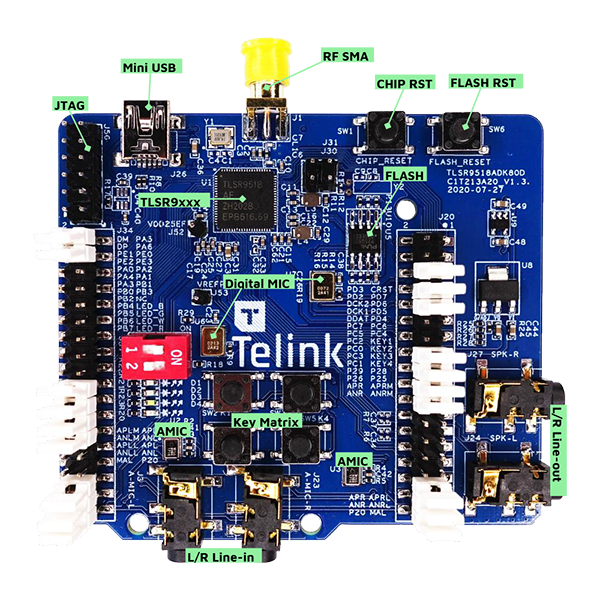

# device_board_telink

## Overview

The TLSR951x Series is the latest addition to Telink’s high-performance, ultra-low-power,
cost-optimized wireless connectivity SoC family. The TLSR951x is a Bluetooth® Dual-mode IC,
having both Bluetooth Classic and Bluetooth LE radios on a single chip. It integrates a powerful
32-bit RISC-V MCU with a variety of powerful core features and peripheral blocks to provide a
foundation for advanced hearable and wearable devices. The TLSR951x includes multi-stage power
management design allowing ultra-low power operation and making it the ideal candidate for
power-sensitive applications. The TLSR951x’s superior level of integration enables customers
to optimise total system cost.




## Specifications

| Item	      | Description                      |
| ----------  | -------------------------------- |
| CPU	      | TLSR9518A, RISC-V (Max: 96MHz)   |
| RAM	      | 256KB SRAM                       |
| Flash	      | 2MB SPI Flash                    |
| GPIO	      | 40                               |
| I2C	      | 1                                |
| UART        | 2                                |
| SPI	      | Memory SPI, HSPI, PSPI           |
| USB	      | 1                                |
| PWM	      | 6                                |
| LED	      | 4                                |
| Debug 	  | JTAG Swire                       |
| ADC	      | 10-channel 14bit auxilary ADC    |
| Button	  | 4                                |

## Environment setup

1. Install Ubuntu dependencies:
   ```bash
   sudo apt-get install build-essential gcc g++ make zlib* libffi-dev e2fsprogs pkg-config flex bison perl bc openssl libssl-dev libelf-dev libc6-dev-amd64 binutils binutils-dev libdwarf-dev u-boot-tools mtd-utils gcc-arm-linux-gnueabi cpio device-tree-compiler
   ```
2. Download and unzip toolchine: http://wiki.telink-semi.cn/tools_and_sdk/Tools/IDE/telink_riscv_linux_toolchain.zip
3. Install toolchain dependencies:
   ```bash
   sudo dpkg --add-architecture i386
   sudo apt-get update
   sudo apt-get install libc6:i386 libncurses5:i386 libstdc++6:i386
   ```
4. Set the environment variable TELINK_RISCV_TOOLCHAIN to the path to GCC toolchain:
   ```bash
   export TELINK_RISCV_TOOLCHAIN=~/progs/telink_riscv_linux_toolchain/nds32le-elf-mculib-v5f/bin
   ```
5. Download and unzip archive: https://chrome-infra-packages.appspot.com/dl/gn/gn/linux-amd64/+/latest
6. Copy file `gn` to any folder in PATH. For example: `sudo cp gn /usr/local/bin/`
7. Install ninja
   ```bash
   sudo apt-get install ninja-build
   ```
8. Check if the package `pip` is installed
   ```bash
   python3 -m pip --version
   ```
   If not instaled:
   ```bash
   sudo apt-get install python3-pip
   ```
9. Install hb:
      ```bash
      python3 -m pip install --user ohos-build==0.4.6
      ```
10. Check if soft link exists `python->python3`

## Build

1. Run in openharmony repo root
3. Run `hb set` and then select project from table:

   | Project name | Description |
   | :--- | :--- |
   | b91_devkit_led_demo | simple led example for b91 devkit |
   | b91_devkit_ble_demo | simple ble example for b91 devkit |
   | b91_devkit_xts_demo | unit tests for b91 devkit |
   
   or set project name as an argument of hb set, like: `hb set -p <project_name>`

4. Run `hb build`
   You can also run with options in the table:

   | Option name | Option description | Option type |
   | :--- | :--- | :---: |
   | disasm_unstripped_version | Use unstripped ELF file version to disassemble and symbols export | binary |
   | telink_gpio_irq_sample_enable | Switch on GPIO IRQ sample | binary | 

For example: `hb build --gn-args='disasm_unstripped_version=true'`
The compiled binary file should be `out/b91_devkit/<project_name>/bin/<project_name>.bin`

## Clean
For do full project clenup (shall be done from openharmony repo root):
```bash
rm -rf out ohos_config.json
```

## Change notes
* In many gn files added include pathes: `//utils/native/lite/include` and `//utils/native/base/include`
