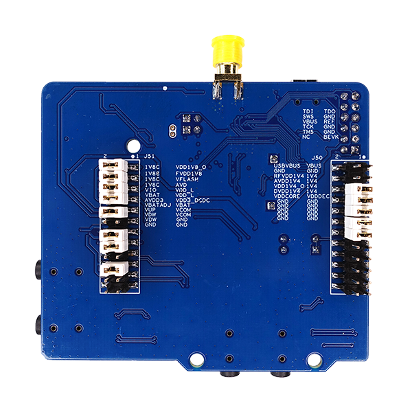

# device_board_telink

## 介绍

泰凌微公司的B91 Generic Starter Kit是一个可用于评估TLSR9系列芯片组的硬件平台，它可以用于开发适用于多种2.4GHz接口标准的应用程序，包括BLE，BLE Mesh、Zigbee 3.0, Thread和2.4GHz私有协议等。

开发板正反面视图如下：

## 开发板规格

| 器件类别  |              开发板              |
| ---------- | -------------------------------- |
| CPU       | TLSR9518A, RISC-V (Max: 96MHz) |
| RAM       | 256KB SRAM                       |
| Flash      | 2MB SPI Flash                    |
| GPIO      | 40                             |
| I2C      | 1                               |
| UART       | 2                                |
| SPI      | Memory SPI, HSPI, PSPI       |
| USB      | 1                            |
| PWM      | 6                             |
| LED      | 4                                |
| Debug     | JTAG、Swire               |
| ADC      | 10-channel 14bit auxilary ADC |
| Button    | 4 |

## OpenHarmonyOS关键特性

| 组件名       | 能力介绍                                                                                       |
| -------------- | ------------------------------------------------------------------------------------------------ |
| 内核         | LiteOS-M                                                                                        |
| 上电启动     | 上电启动OpenHarmonyOS                                                                          |
| BLE服务      | 提供BLE功能                                          |
| 外设控制     | 提供操作外设的能力，包括：I2C、ADC、UART、SPI、GPIO、PWM、FLASH等。                      |
| 系统服务管理 | 系统服务管理基于面向服务的架构，提供了OpenHarmonyOS统一化的系统服务开发框架。                  |
| 启动引导     | 提供系统服务的启动入口标识。在系统服务管理启动时，调用boostrap标识的入口函数，并启动系统服务。 |
| 系统属性     | 提供获取与设置系统属性的能力。                                                                   |
| 基础库       | 提供公共基础库能力，包括：文件操作、KV存储管理等。                                                      |
| DFX          | 提供DFX能力，包括：流水日志等。                                                     |
| HDF           | 提供OpenHarmony硬件配置驱动的能力。                                                         |
| XTS          | 提供OpenHarmonyOS生态认证测试套件的集合能力。                                                    |

## 开发板设计文档

参考 [开发板设计文档](http://wiki.telink-semi.cn/doc/hw/B91_DevelopmentBoard_TLSR9518ADK80D.zip)

## 环境搭建

参考 [环境搭建步骤](https://gitee.com/openharmony-sig/device_soc_telink/blob/master/README_zh.md#1-工具安装)

## 编译调试

参考 [编译调试步骤](https://gitee.com/openharmony-sig/device_soc_telink/blob/master/README_zh.md#4-编译工程)

## 示例代码

代码默认有3个示例：

1. [LED应用示例](https://gitee.com/openharmony-sig/vendor_telink/tree/master/b91_devkit_led_demo)

2. [BLE测试示例](https://gitee.com/openharmony-sig/vendor_telink/tree/master/b91_devkit_ble_demo)

3. [XTS测试示例](https://gitee.com/openharmony-sig/vendor_telink/tree/master/b91_devkit_xts_demo)

## 联系

如果您在开发过程中有问题，请在仓库[issues](https://gitee.com/openharmony-sig/device_board_telink/issues)提问。
