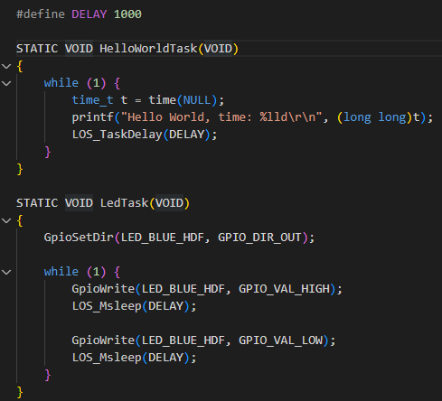
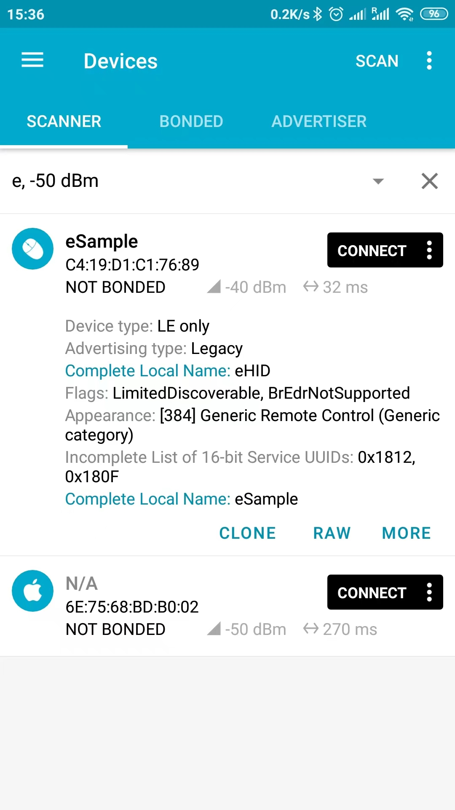
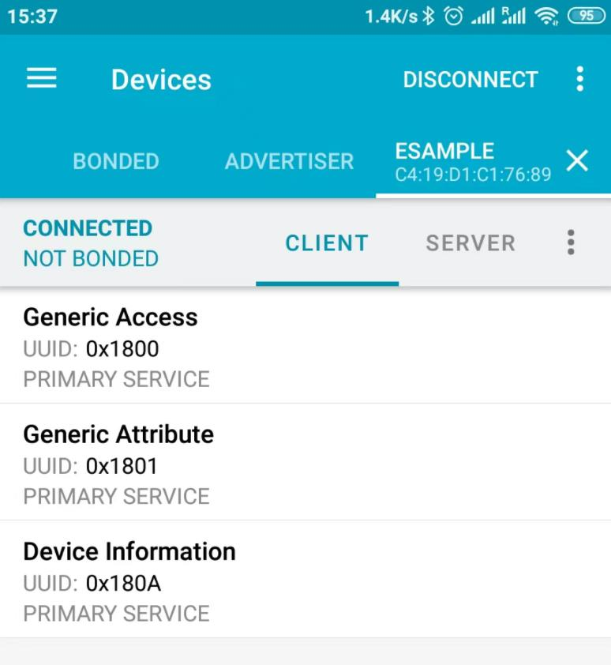

# device_board_telink

- [device_board_telink](#device_board_telink)
  - [简介](#简介)
  - [开发板规格](#开发板规格)
  - [OpenHarmony关键特性](#openharmony关键特性)
  - [开发板设计文档](#开发板设计文档)
  - [环境搭建](#环境搭建)
  - [编译调试](#编译调试)
  - [示例代码](#示例代码)
  - [联系](#联系)

## 简介

泰凌微公司的B91 Generic Starter Kit是一个可用于评估TLSR9系列芯片组的硬件平台，BLE，BLE Mesh，Zigbee 3.0, Thread和2.4GHz私有协议等多种适用于2.4GHz接口标准的应用程序都可以用它来进行开发。如果有兴趣了解更多相关信息，可以在 [B91 Generic Starter Kit Hardware Guide](http://wiki.telink-semi.cn/wiki/Hardware/B91_Generic_Starter_Kit_Hardware_Guide/) 中进行浏览。

开发板正反面视图如下：


## 开发板规格

| 器件类别  |              开发板              |
| ---------- | -------------------------------- |
| CPU       | TLSR9518A, RISC-V (Max: 96MHz) |
| RAM       | 256KB SRAM                       |
| Flash      | 2MB SPI Flash                    |
| GPIO      | 40                             |
| I2C      | 1                               |
| UART       | 2                                |
| SPI      | Memory SPI, HSPI, PSPI       |
| USB      | 1                            |
| PWM      | 6                             |
| LED      | 4                                |
| Debug     | JTAG、Swire               |
| ADC      | 10-channel 14bit auxilary ADC |
| Button    | 4 |

## OpenHarmony关键特性

| 组件名       | 能力介绍                                                                                       |
| -------------- | ------------------------------------------------------------------------------------------------ |
| 内核         | LiteOS-M                                                                                        |
| 上电启动     | 上电启动OpenHarmony                                                                          |
| BLE服务      | 提供BLE功能                                          |
| 外设控制     | 提供操作外设的能力，包括：I2C、ADC、UART、SPI、GPIO、PWM、FLASH等。                      |
| 系统服务管理 | 系统服务管理基于面向服务的架构，提供了OpenHarmony统一化的系统服务开发框架。                  |
| 启动引导     | 提供系统服务的启动入口标识。在系统服务管理启动时，调用boostrap标识的入口函数，并启动系统服务。 |
| 系统属性     | 提供获取与设置系统属性的能力。                                                                   |
| 基础库       | 提供公共基础库能力，包括：文件操作、KV存储管理等。                                                      |
| DFX          | 提供DFX能力，包括：流水日志等。                                                     |
| HDF           | 提供OpenHarmony硬件配置驱动的能力。                                                         |
| XTS          | 提供OpenHarmony生态认证测试套件的集合能力。                                                    |

## 开发板设计文档

B91开发板的总体情况可以参见 [B91 Generic Starter Kit Hardware Guide](http://wiki.telink-semi.cn/wiki/Hardware/B91_Generic_Starter_Kit_Hardware_Guide/) 的Overview章节。

详细的开发设计文档可以下载 [Reference Design](http://wiki.telink-semi.cn/doc/hw/B91_DevelopmentBoard_TLSR9518ADK80D.zip) 到本地后，解压后查阅。

## 环境搭建

推荐在Windows+Ubuntu环境下进行开发，如果对环境搭建的过程有问题，可以参见 [环境搭建步骤](https://gitee.com/openharmony-sig/device_soc_telink/blob/master/README_zh.md#安装工具) 中开发环境、安装工具、获取源码、确认目录结构等章节。

## 编译调试

在完成上述环境搭建之后，可以进行编译生成B91开发板上所需的二进制固件。可以使用烧录工具将固件烧录进B91开发板。
编译调试的详细过程可以参见 [编译调试步骤](https://gitee.com/openharmony-sig/device_soc_telink/blob/master/README_zh.md#编译工程) 中编译工程、烧录固件等章节。

## 示例代码

可以将示例生成的二进制固件烧录进B91开发板，代码默认有3个示例：

1. [LED应用示例](https://gitee.com/openharmony-sig/vendor_telink/tree/master/b91_devkit_led_demo)

    在B91开发板上烧录`b91_devkit_led_demo.bin`并上电重启后，可以实现简单的点亮LED灯的功能。
    其主要功能的任务代码如下图所示：

    

    第一个任务是使用串口模块打印出`Hello World, time:{RUNNING_TIME_SECOND}`，另一个是使用开发板上GPIO口去操控蓝色LED灯，实现闪烁效果。
    这里的打印间隔以及LED闪烁的间隔都由宏`DELAY`定义，即1000ms。
    另外，打印出的时间戳`{RUNNING_TIME_SECOND}`也根据`DELAY`的取值而计时。

2. [BLE测试示例](https://gitee.com/openharmony-sig/vendor_telink/tree/master/b91_devkit_ble_demo)

    在B91开发板上烧录`b91_devkit_ble_demo.bin`并上电重启后，可以实现BLE协议栈的相关功能。
    通过智能手机上的蓝牙连接工具，如nRF Connect，可以搜索到名为“eSample”的BLE测试示例的广播信息，如下图：

    

    点击“CONNECT”按钮之后，手机会和B91开发板建立起蓝牙连接，可以在下图中查看到所建立的GATT服务：

    

    同时，白色的LED灯会在建立连接时进入常亮状态，提示蓝牙已连接。此时按下“DISCONNECT"按钮，蓝牙连接会断开，白灯熄灭。

3. [XTS测试示例](https://gitee.com/openharmony-sig/vendor_telink/tree/master/b91_devkit_xts_demo)

    XTS测试示例是OpenHarmony生态认证测试套件的集合的XTS子系统，在B91开发板上进行的实现。
    本实现参考了应用兼容性测试套件中的[测试用例源码与配置文件](https://gitee.com/openharmony/xts_acts)和[测试用例开发框架](https://gitee.com/openharmony/xts_tools)。

    在B91开发板上烧录`b91_devkit_xts_demo.bin`并上电重启后，会运行以下XTS测试用例集合。

    ```shell
        "module_ActsKvStoreTest",
        "module_ActsUtilsFileTest",
        "module_ActsParameterTest",
        "module_ActsBootstrapTest",
        "module_ActsHieventLiteTest",
        "module_ActsDfxFuncTest",
        "module_ActsSamgrTest",
    ```

    也可以在`b91_devkit_xts_demo\BUILD.gn`当中添加您想要的测试用例集合，测试结果会以串口打印输出。

## 联系

如果您在开发过程中有问题，请在仓库[issues](https://gitee.com/openharmony-sig/device_board_telink/issues)提问。
